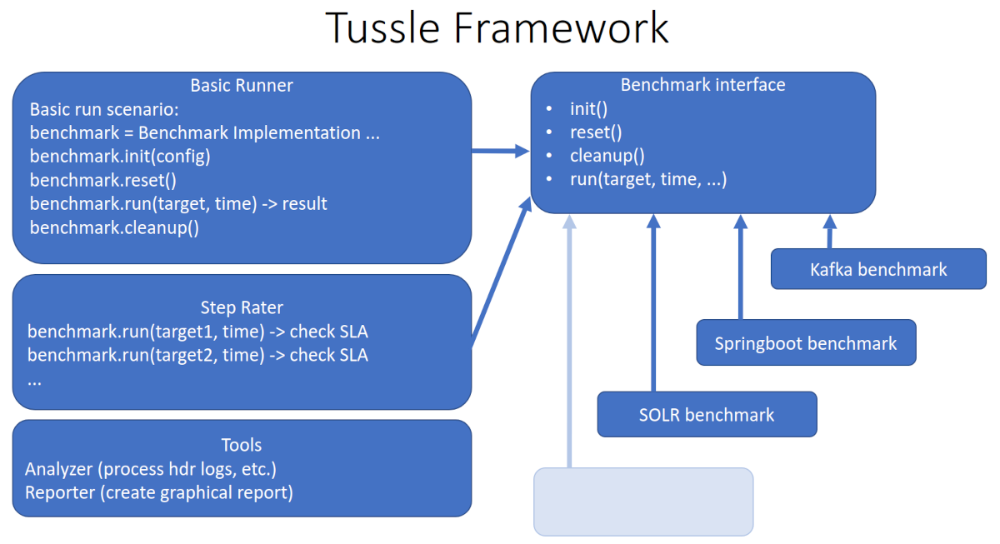
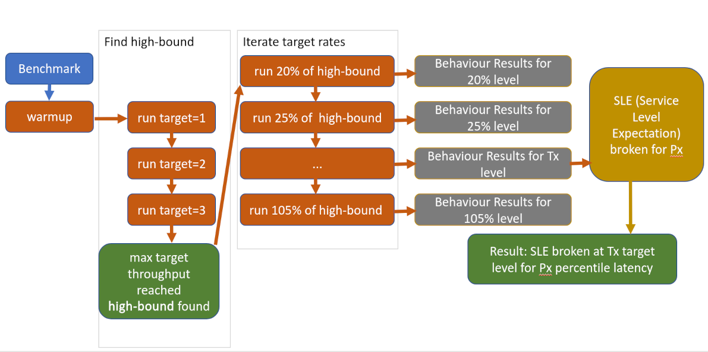
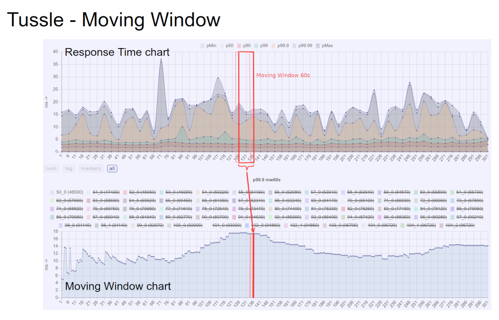

About
=====

Tussle Framework - Throughput under Service Level Expectation testing framework which includes common interfaces, tools, benchmark runners, metrics, and etc.

It has basic benchmark interface and classes required for constructing ISV benchmarks: "Benchmark", "BenchmarkConfig", etc. The real Benchmark implementations are available in separate projects (repositories) and not included in this project except some simple Benchmark examples.

Also Tussle Framework includes integrated helpful tools intended to process results and make reports.



Service Level Expectation
=========================

Service Level Expectation or SLE is a key notion in the Throughput under SLE testing. The notion of SLE is generic. Tussle methodology does not define specific criteria for what constitutes an SLE, but it provides useful examples.

The SLEs are binary pass/fail things. The SLE is either met or not. The formulation of the SLE itself is application and domain specific. And SLE will (very often) include multiple statements, all of which must hold true for the SLE to be considered "met".

Here is an elaborate of what an elaborate SLE for a service may be:
- The median response time in any given 10 second period must remain below 10msec.
- The 99% percentile response time in any given 10 second period must remain below 10msec.
- The 99.9% percentile response time in any given 60 second period must remain below 50msec.
- The 99.99% percentile response time in any given 5 minute period must remain below 200msec.
- At least 63% of color queries in a any given minute must show the color blue. [Yes, this is meant as an example of an arbitrary, domain specific SLE].
- The number of widgets that are observed to be pink in any 3 minute period except for 2 (3 minute period) in any given hour must be no more than 17.

A simpler example can be paired down to e.g. (lets call this "Kafka SLE1"):
- The 99% percentile response time in any given 10 second period must remain below 20msec.
- The 99.9% percentile response time in any given 60 second period must remain below 50msec.
- The 99.99% percentile response time in any given 5 minute period must remain below 200msec.

To meet this SLE, *ALL* of it's sub-statements must hold true. If a load is run at some throughput, and even one of these statemement end up false, the SLE is breached at the attempted target throughput.

License
=======

The Spring Framework is released under [BSD 3-Clause License](LICENSE)

Build
=====

Build:

```
$ mvn clean package -DskipTests

```

Optionally install **tussle-framework jar** in the local Maven repository to be visible for other projects depending on tussle-framework:

```
$ mvn install:install-file -Dfile=target/tussle-framework-$version-jar-with-dependencies.jar -DpomFile=pom.xml
```

Alternatively it can be build and installed using provided script:

```
$ ./build.sh
```

Run
===

Run syntax is following:

     $ java -jar target/tussle-framework-*.jar benchmark-class-name [benchmark-args...] \
     [--runner runner-class-name [runner-args...]]


Basic Runner
============

runner-class-name = **BasicRunner** or **org.tussleframework.runners.BasicRunner**

Basic Runner is a "classical" and default benchmark runner which simply runs provided benchmark and collects results basically represented as histogram data and summary scores (throughput, latency percentiles, etc.). 

###### Basic Runner workflow
    * benchmark.run(target, warmup, run) -> result histogram and summary


Scenario Runner
===============

runner-class-name = **ScenarioRunner** or **org.tussleframework.runners.ScenarioRunner**

Scenario Runner performs run of a benchmark using sequence of provided target rates and run times.

###### Scenario Runner workflow
    * benchmark.run(target1, warmup1, run1) -> result 1 histogram and summary
    * benchmark.run(target2, warmup2, run2) -> result 2 histogram and summary
    * benchmark.run(target3, warmup3, run3) -> result 3 histogram and summary
    ...


StepRater
=========

runner-class-name = **StepRater** or **org.tussleframework.runners.StepRater**

StepRater fully realizes Throughput under SLE concept. It is multi-step benchmark runner which iterates over several target rates and collect results at each target rate step. It uses **high-bound** which is automatically detected as max achievable rate or provided by setup. Its value used as upper target rate bound for target rates iteration. Target rate on each steps is calculated as percent of high-bound. There are starting and finishing percent rates, e.g. 20 and 110. The collected results used for finding the highest throughput under which the **Service Level Expectation (SLE)** is met.

###### Steprater workflow
    *  benchmark.run(startup warmup)
    *  high-bound = find high bound or use provided value
    *  iterate target rates:
    *    benchmark.run(target1, warmup, run) -> result 1
    *    benchmark.run(target2, warmup, run) -> result 2
    *    benchmark.run(target3, warmup, run) -> result 3
    *    ...
    *    benchmark.run(targetE, warmup, run) -> result E
    *  Analyse results:
    *    SLE 1 broken on target X
    *    SLE 2 broken on target Y





Benchmark as External Process
=============================

benchmark-class-name = **ProcBenchmark** or **org.tussleframework.runners.ProcBenchmark**

This is an adapter for running any third party benchmark as external process and which produce result files in the HDR format.
It has following configuration properties:

    runCmd - required run command which accepts 'warmupTime', 'runTime', 'targetRate' and step parameters which passed by Tussle Framework
    runDir - optional working dir for the process started by the runCmd
    runEnv - list of 'ENV_VAR=value' pairs passed as additional environment to the runCmd
    initCmd - optional init command
    resetCmd - optional reset command
    cleanupCmd - optional cleanup command
    hdrResults - list of resulting HDR files
    delay - additional delay for wait process time, all wait time is a sum of = warmupTime + runTime + delay


Examples
========

Run PI benchmark using default Basic runner and default benchmark parameters:

    $ java -jar target/tussle-framework-*.jar PiBenchmark

using benchmark parameters:

    $ java -jar target/tussle-framework-*.jar PiBenchmark threads=4
 
using benchmark parameters and runner parameters:

    $ java -jar target/tussle-framework-*.jar PiBenchmark threads=2 \
    --runner BasicRunner warmupTime=20s runTime=2m targetRate=1.5k
     
    $ java -jar target/tussle-framework-*.jar PiBenchmark threads=2 \
    --runner ScenarioRunner scenario=[[100,0,1m],[1k,0,10s],[100,0,1m]] makeReport=true

using ProcBenchmark for running custom benchmark:

    $ cat proc.config
    runCmd:
      - run-benchmark.sh
      - warmup={warmupTime}
      - time={runTime},tt={targetRate}
    runDir:
       - results_step{runStep}_wrm{warmupTime}_time{runTime}_rate{targetRate}
    hdrResults:
       - .*.hdr  # java regexp supported - find all files under runDir with 'hdr' extension
    
    $ java -jar target/tussle-framework-*.jar ProcBenchmark -f proc.config \
    --runner BasicRunner warmupTime=1m runTime=10m targetRate=100k


Tussle Metrics
==============

Tussle Framework basically operates with histogram data and can provide different metrics: percentiles, operation counts per interval, moving window metrics. One of example is below:





